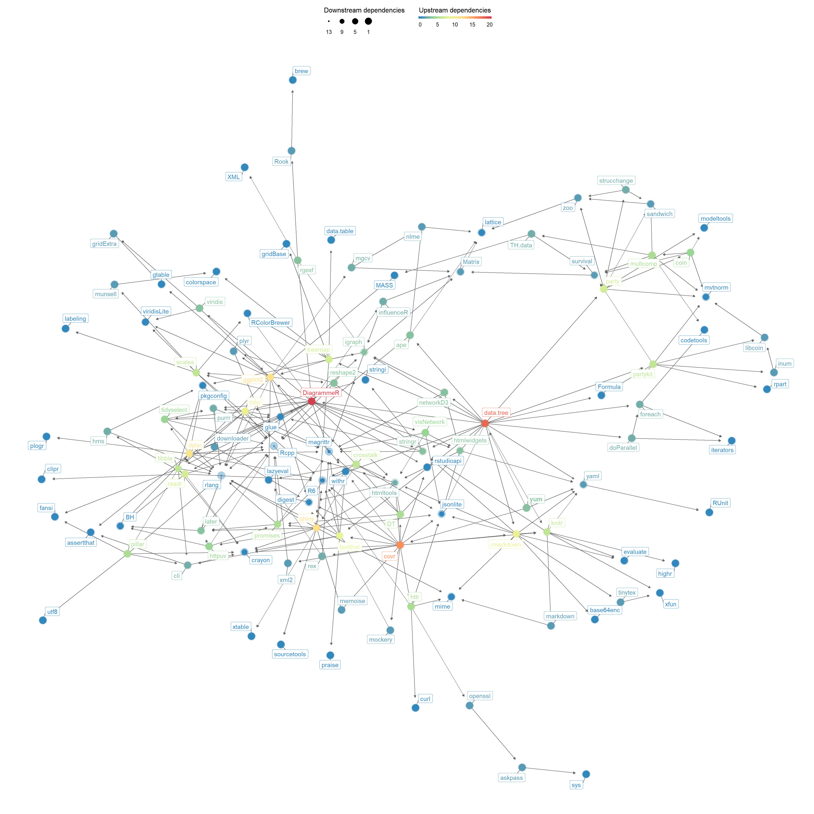

<!-- README.md is generated from README.Rmd. Please edit that file -->
yum: YAML Utilities & More
==========================

The goal of `yum` is to provide a number of functions to work with files that contain one or more YAML fragments. Several packages leverage the YAML format to facilitate systematic encoding of information in a format that is both machine- and human-readable. The yum package provides a number of functions to facilitate this in a uniform manner with minimal dependencies (i.e. only suggests \[yaml::yaml\] and \[data.tree::data.tree\] to enable additional functionality).

<!-- [](https://cran.r-project.org/package=yum) -->
[](https://travis-ci.org/Matherion/yum)

Installation
------------

You can install the released version of yum from [CRAN](https://CRAN.R-project.org) with:

``` r
install.packages("yum");
```

Dependencies
------------

`yum` was created to have minimal dependencies. However, you will usually want to have either \[yaml::yaml\] or \[data.tree::data.tree\] available to be able to actually load (parse) the extracted YAML fragments and organise them in a tree if they have a hierarchical structure. Therefore, `yum` does have some dependencies through those two suggested packages. Of these, `yaml` only has one dependency, but `data.tree` has a few more. Specifically, the dependency network looks like this:


